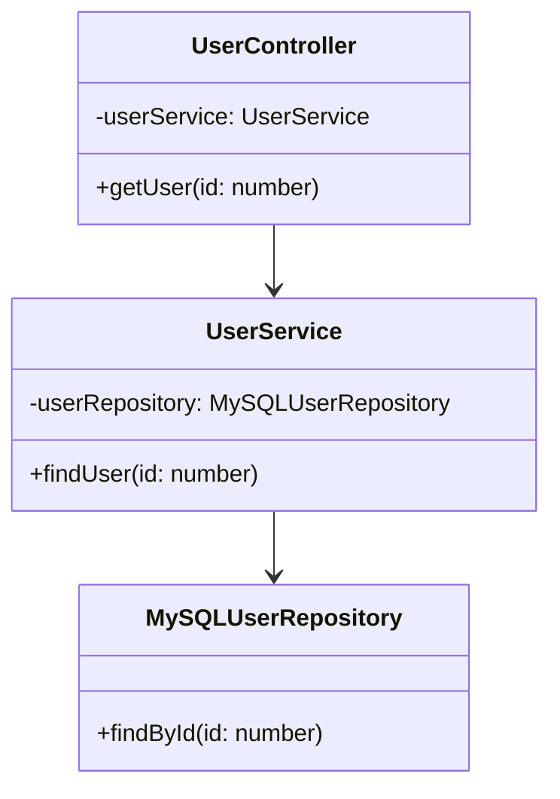
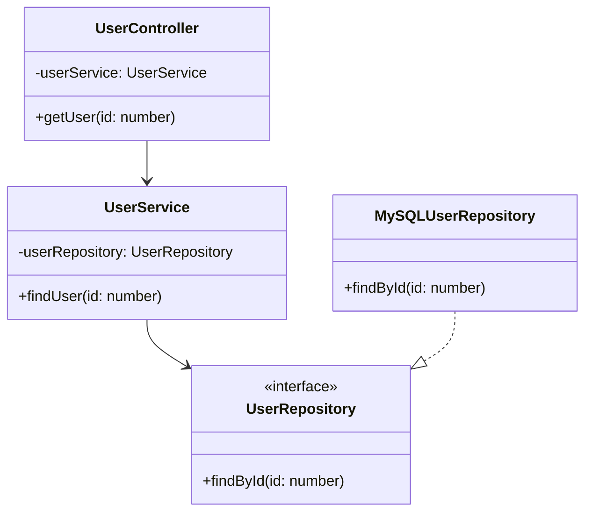

# 새롭게 알게 된 내용

## 트랜잭션 메모리

```bash
트랜잭션 메모리는 데이터베이스가 디스크의 레코드를 다루는 방식과 동일한 방식으로 메모리의 변수를 처리한다. 
즉, 트랜잭션을 사용하거나 또는 재시도 기법을 통해 이들 변수를 보호한다.
- p57

트랜잭션 메모리는 불러오기와 저장하기 명령의 집합이 원자적 방법으로 실행할 수 있게 함으로써
병행성 프로그래밍을 단순하게 하는 방식이다. 병행 컴퓨팅에서 공유 메모리로의 접근을 제어하기 위한 병행성 제어방식으로,
데이터베이스 트랜잭션과 유사한 동시성 제어 구조이다.
- 위키백과
```

# 어려웠거나 궁금했던 점
## 의존성의 역전

### Before (의존성 역전 적용 전)


### After (의존성 역전 적용 후)


### 의존성 역전인 이유

- Before:
UserService가 MySQLUserRepository를 직접 사용한다. 즉, "고수준 모듈(UserService)"이 "저수준 모듈(MySQLUserRepository)"에 의존한다. 만약 PostgreSQL로 바꾸고 싶다면? UserService 코드를 수정해야 한다.

- After:
UserService는 추상화된 UserRepository 인터페이스만 바라본다. MySQLUserRepository는 이 인터페이스를 구현한다.
이제 "저수준 모듈(MySQLUserRepository)"이 "인터페이스(UserRepository)"에 맞추도록 바뀌었다.
PostgreSQL로 바꾸고 싶다면? UserService 코드는 그대로 두고, PostgreSQLRepository만 새로 만들면 된다.

### 결국 PostgreSQL로 바꾸고 싶다면 새로운 파일을 만들어야 하는 것이 아닐까?
- 코드 수정 범위:  
Before: UserService와 새로운 Repository 둘 다 수정/생성 필요  
After: 새로운 Repository만 생성하면 됨

- 테스트 용이성:  
Before: UserService를 테스트하려면 실제 DB 연결이 필요  
After: 가짜 Repository(Mock)를 만들어서 테스트 가능

- 확장성:
Before: 새로운 DB 추가할 때마다 UserService 수정 필요  
After: UserService는 그대로 두고 새로운 Repository만 추가하면 됨


### 핵심
UserRepository 인터페이스는 "의존성을 가진다"가 아닌, 오히려 "다른 것들이 나를 따르게 한다"로 봐야한다.  
구체적인 구현체(MySQL, PostgreSQL)이 추상적인 인터페이스를 "따르게" 되는 것이므로, 이것을 의존성이 "역전"된다고 하는 이유이다.

### 번외
다른 SOLID 원칙에 비해 DIP를 준수하게 되면, 다른 원칙들도 따라오는 경우가 많다.
그 이유는 아래와 같다.

고수준 모듈이 저수준 모듈에 의존하지 않게 하고 (추상화에 의존) 추상화가 구체화에 의존하지 않게 해야 한다.  

이 과정에서 인터페이스를 분리하게 되고 (ISP) 각 클래스가 단일 책임을 갖게 되며 (SRP)  
구현체들이 대체 가능해지고 (LSP) 확장에는 열려있고 수정에는 닫히게 됩니다 (OCP)

# 업무와 관련된 내용

```bash
소프트웨어 개체의 행위는 확장할 수 있어야 하지만, 개체를 변경해서는 안된다.
소프트웨어 아키텍처를 공부하는 가장 근본적인 이유가 바로 이 때문이다. 
만약 요구사항을 살짝 확장하는 데 소프트웨어를 엄청나게 수정해야 한다면,
그 소프트웨어 시스템을 설계한 아키텍트는 엄청난 실패에 맞닥뜨린 것이다.
- p74
```

최근, 대표님과 이야기를 가장 많이 나누는 내용 중 하나여서 작성했습니다.

`비즈니스를 모듈화 하면 안되는 이유`로 이야기를 나누고 있습니다. 비즈니스는 변화가 잦기 때문에, 변경할 수밖에 없는 서비스는 모듈화하면 안된다는 이야기입니다.

그리고 여기서 제시하는 `변경해서는 안된다`라는 전제 조건 때문에, 개발자들끼리 많은 협의가 필요하고 그 협의를 하기 위한 시간 투자가 많이 이루어져야 합니다. 이에 또 하나의 고민이 튀어나오게 됩니다.
’시간 투자를 할만한 고민인가?’, ‘이 시간에 개발을 하는 것이 좋은가, 이런 구조에 대해 이야기를 나누는 것이 좋은가?’.

어떤 레버리지를 당겨 쓸 지는 각자가 판단할 문제 같습니다.

# 추가 내용